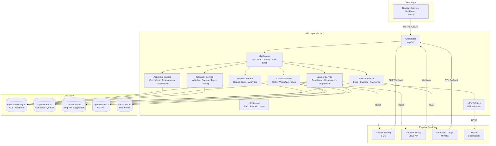
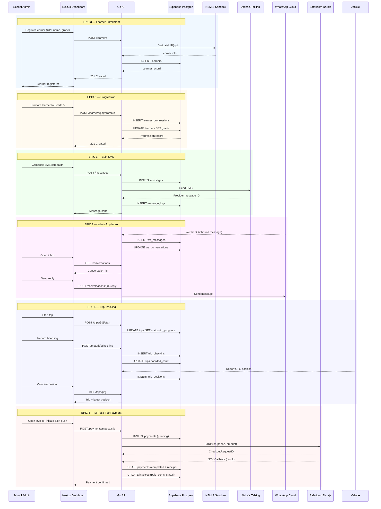

# Shule360 — School Management System

A multi-tenant school management platform for Kenyan public schools under the **Competency-Based Curriculum (CBC)**. Shule360 digitizes the full school lifecycle — communications, learner records, academics, transport, and finance — with a focus on the unique needs of Kenyan schools (NEMIS integration, Africa's Talking SMS, WhatsApp Business, CBC assessment rubrics).

> **Status:** EPIC 7 complete — Human Resources (Staff, Payroll, Leave) + Reports & Analytics + Finance + Transport + Learner Records + Academic + Communications

---

## Table of Contents

- [Tech Stack](#tech-stack)
- [Architecture](#architecture)
- [Repository Structure](#repository-structure)
- [Database Schema](#database-schema)
- [API Endpoints](#api-endpoints)
- [Authentication & Multi-Tenancy](#authentication--multi-tenancy)
- [Getting Started](#getting-started)
- [Environment Variables](#environment-variables)
- [Testing](#testing)
- [Roadmap](#roadmap)

---

## Tech Stack

| Layer | Technology | Purpose |
|-------|-----------|---------|
| **Backend** | Go 1.22 + Chi router | REST API, business logic |
| **Database** | Supabase (PostgreSQL 15) | Primary data store, RLS, Realtime |
| **Cache / Queue** | Upstash Redis | Rate limiting, job queues, drafts |
| **Vector / Search** | Upstash Vector + Search | Template suggestions, full-text search |
| **Object Storage** | Backblaze B2 | Learner documents, media, evidence |
| **SMS** | Africa's Talking | Bulk SMS, delivery receipts |
| **WhatsApp** | Meta Cloud API v19.0 | Broadcasts, 2-way inbox, chatbot |
| **M-Pesa** | Safaricom Daraja API | STK push fee collection |
| **NEMIS** | Sandbox client (stub) | UPI validation, learner lookup |
| **Frontend** | Next.js 16 (Turbopack) + React 19 + Tailwind | Admin dashboard |
| **Fonts** | Raleway (next/font) | Brand typography |

---

## Architecture



---

## Repository Structure

```mermaid
graph TD
    ROOT["shule360/"] --> API["api/ — Go Backend"]
    ROOT --> WEB["web/ — Next.js Frontend"]
    ROOT --> README["README.md"]
    ROOT --> SPEC["shule360-spec.md"]

    API --> CMD["cmd/server/"]
    API --> INTERNAL["internal/"]
    API --> PKG["pkg/"]
    API --> MIG["migrations/"]
    API --> ENV[".env.example"]
    API --> DOCKER["Dockerfile"]
    API --> FLY["fly.toml"]
    API --> MAKE["Makefile"]

    CMD --> MAIN["main.go — entrypoint, wiring, router"]

    INTERNAL --> ACAD["academic/"]
    INTERNAL --> COMMS["comms/"]
    INTERNAL --> LEARN["learner/"]
    INTERNAL --> MID["middleware/"]
    INTERNAL --> NEMIS["nemis/"]
    INTERNAL --> TRANSP["transport/"]
    INTERNAL --> FIN["finance/"]
    INTERNAL --> REPORTS["reports/"]
    INTERNAL --> HR["hr/"]
    INTERNAL --> TENANT["tenant/"]
    INTERNAL --> CONFIG["config/"]

    TRANSP --> TSVC["service.go"]
    TRANSP --> TTRIP["trips.go"]
    TRANSP --> TTYPE["types.go"]
    TRANSP --> THAND["handler.go"]

    FIN --> FSVC["service.go"]
    FIN --> FMPESA["mpesa.go"]
    FIN --> FTYPE["types.go"]
    FIN --> FHAND["handler.go"]

    REPORTS --> RSVC["service.go"]
    REPORTS --> RTYPE["types.go"]
    REPORTS --> RHAND["handler.go"]

    HR --> HSVC["service.go"]
    HR --> HSVCLEAVE["service_leave.go"]
    HR --> HTYPE["types.go"]
    HR --> HHAND["handler.go"]

    ACAD --> ACADH["handler.go"]
    ACAD --> CURR["curriculum/"]
    ACAD --> ASSESS["assessment/"]
    ACAD --> ATT["attendance/"]

    COMMS --> COMMSH["handler.go"]
    COMMS --> SVCS["service.go"]
    COMMS --> SMS["sms/"]
    COMMS --> WA["whatsapp/"]
    COMMS --> INBOX["inbox/"]

    LEARN --> LSVC["service.go"]
    LEARN --> LDOC["documents.go"]
    LEARN --> LPROG["progression.go"]
    LEARN --> LHAND["handler.go"]

    MID --> AUTH["auth.go"]
    MID --> TEN["tenant.go"]
    MID --> RATE["ratelimit.go"]

    PKG --> HTTPUTIL["httputil/"]
    PKG --> SUPABASE["supabase/"]
    PKG --> UPSTASH["upstash/"]
    PKG --> B2["backblaze/"]
    PKG --> MPESA["mpesa/"]

    MIG --> M001["001_tenants.sql"]
    MIG --> M002["002_staff_auth.sql"]
    MIG --> M003["003_guardians.sql"]
    MIG --> M004["004_learners.sql"]
    MIG --> M005["005_messages.sql"]
    MIG --> M006["006_message_logs.sql"]
    MIG --> M007["007_wa_conversations.sql"]
    MIG --> M008["008_wa_messages.sql"]
    MIG --> M009["009_curriculum.sql"]
    MIG --> M010["010_assessments.sql"]
    MIG --> M011["011_attendance.sql"]
    MIG --> M012["012_learner_enrollment.sql"]
    MIG --> M013["013_learner_progression.sql"]
    MIG --> M014["014_vehicles.sql"]
    MIG --> M015["015_routes.sql"]
    MIG --> M016["016_trips.sql"]
    MIG --> M017["017_fee_structures.sql"]
    MIG --> M018["018_invoices.sql"]
    MIG --> M019["019_payments.sql"]
    MIG --> M020["020_report_cards.sql"]
    MIG --> M021["021_analytics_views.sql"]
    MIG --> M022["022_staff_profiles.sql"]
    MIG --> M023["023_payroll.sql"]
    MIG --> M024["024_leave.sql"]
    MIG --> SEED["seed/seed.sql"]

    WEB --> APP["app/"]
    WEB --> COMP["components/"]
    WEB --> LIB["lib/"]
    WEB --> PKGJSON["package.json"]
    WEB --> NEXT["next.config.js"]
    WEB --> TAIL["tailwind.config.ts"]

    APP --> ADMIN["(admin)/"]
    APP --> AUTH["(auth)/"]
    ADMIN --> DASH["dashboard/"]
    ADMIN --> COMMS["communications/"]
    ADMIN --> ACAD["academic/"]
    ADMIN --> LEARN["learners/"]
    ADMIN --> VEHICLES["vehicles/"]
    ADMIN --> ROUTES["routes/"]
    ADMIN --> TRIPS["trips/"]
    ADMIN --> FINANCE["finance/"]
    ADMIN --> REPORTS["reports/"]
    ADMIN --> ANALYTICS["analytics/"]
    ADMIN --> HR["hr/"]
    COMP --> LAYOUT["layout/"]
    COMP --> COMMS["comms/"]
    COMP --> UI["ui/"]
    LIB --> API["api.ts — typed fetch wrapper"]
    LIB --> SUPABASE["supabase.ts"]
```



### Detailed File Tree

```
shule360/
├── README.md
├── shule360-spec.md
├── api/                          # Go Backend
│   ├── cmd/server/main.go        # Entrypoint, dependency wiring, router
│   ├── internal/
│   │   ├── academic/             # EPIC 2 — Academic
│   │   │   ├── handler.go        # Curriculum + Assessment + Attendance routes
│   │   │   ├── curriculum/       # KICD learning areas, strands, sub-strands, SLOs
│   │   │   ├── assessment/       # CBC rubric assessments (1-4), term summaries
│   │   │   └── attendance/       # Daily roll call, chronic absenteeism
│   │   ├── comms/                # EPIC 1 — Communications
│   │   │   ├── handler.go        # Message + conversation routes
│   │   │   ├── service.go        # Create/send/list/cancel messages
│   │   │   ├── sms/              # Africa's Talking client + tests
│   │   │   ├── whatsapp/         # Meta Cloud API, chatbot, webhook, templates
│   │   │   └── inbox/            # Conversation inbox service
│   │   ├── learner/              # EPIC 3 — Learner Records
│   │   │   ├── service.go        # CRUD + NEMIS validation
│   │   │   ├── documents.go      # Document upload/list/delete
│   │   │   ├── progression.go    # Promote/retain/transfer
│   │   │   └── handler.go        # 17 learner routes
│   │   ├── transport/            # EPIC 4 — Transport
│   │   │   ├── types.go          # Domain types & requests
│   │   │   ├── service.go        # Vehicles, routes, stops, assignments CRUD
│   │   │   ├── trips.go          # Trips, GPS positions, check-ins
│   │   │   └── handler.go        # 20 transport routes
│   │   ├── finance/              # EPIC 5 — Finance
│   │   │   ├── types.go          # Domain types & requests
│   │   │   ├── service.go        # Fee structures, invoices, discounts, payments
│   │   │   ├── mpesa.go          # M-Pesa STK push + callback confirmation
│   │   │   └── handler.go        # 22 finance routes
    │   │   ├── reports/              # EPIC 6 — Reports & Analytics
    │   │   │   ├── types.go          # Report card + analytics types
    │   │   │   ├── service.go        # Report card generation, analytics queries
    │   │   │   └── handler.go        # 12 reports & analytics routes
    │   │   ├── hr/                   # EPIC 7 — Human Resources
    │   │   │   ├── types.go          # Staff, payroll, leave, appraisal types
    │   │   │   ├── service.go        # Staff, documents, payroll CRUD
    │   │   │   ├── service_leave.go  # Leave, staff attendance, appraisals
    │   │   │   └── handler.go        # 28 HR routes
    │   │   ├── middleware/           # JWT auth, tenant, rate limiting
│   │   ├── nemis/                # NEMIS client interface + sandbox stub
│   │   ├── tenant/               # Tenant service
│   │   └── config/               # Env config loader
│   ├── pkg/
│   │   ├── httputil/             # JSON response helpers
│   │   ├── supabase/             # pgx pool + auth client
│   │   ├── upstash/              # Redis, Vector, Search clients
│   │   ├── backblaze/            # B2 S3-compatible client
│   │   └── mpesa/                # Safaricom Daraja STK push client
    │   ├── migrations/               # 24 SQL migrations + seed
│   ├── .env.example
│   ├── Dockerfile
│   ├── fly.toml
│   └── Makefile
└── web/                          # Next.js 16 Frontend
    ├── app/
    │   ├── (admin)/              # Authenticated admin area
    │   │   ├── dashboard/        # Overview dashboard
    │   │   ├── communications/   # SMS, WhatsApp, Inbox, Templates
    │   │   ├── academic/         # Curriculum, Assessments, Attendance
    │   │   ├── learners/         # List, Register, Detail (EPIC 3)
    │   │   ├── vehicles/         # Fleet management (EPIC 4)
    │   │   ├── routes/           # Routes, stops, assignments (EPIC 4)
    │   │   ├── trips/            # Schedule, track, check-ins (EPIC 4)
    │   │   ├── finance/          # Overview, fees, invoices, payments (EPIC 5)
    │   │   ├── reports/          # Overview, report cards (EPIC 6)
    │   │   ├── analytics/        # Learning analytics dashboard (EPIC 6)
    │   │   └── hr/               # Overview, staff, payroll, leave, attendance, appraisals (EPIC 7)
    │   ├── (auth)/login/         # Login page
    │   ├── layout.tsx            # Root layout (Raleway font)
    │   └── globals.css
    ├── components/
    │   ├── layout/Sidebar.tsx    # Admin navigation
    │   ├── comms/                # Audience builder, thread, stats, composer
    │   └── ui/
    ├── lib/
    │   ├── api.ts                # Typed fetch wrapper (all endpoints)
    │   └── supabase.ts           # Lazy-initialized Supabase client
    ├── next.config.js
    ├── tailwind.config.ts
    └── package.json
```

---

## Database Schema

```mermaid
erDiagram
    TENANTS ||--o{ STAFF : "employs"
    TENANTS ||--o{ GUARDIANS : "has"
    TENANTS ||--o{ LEARNERS : "enrolls"
    TENANTS ||--o{ MESSAGES : "sends"
    TENANTS ||--o{ WA_CONVERSATIONS : "hosts"
    TENANTS ||--o{ LEARNING_AREAS : "uses"
    TENANTS ||--o{ CORE_COMPETENCIES : "defines"
    TENANTS ||--o{ VALUES : "defines"
    TENANTS ||--o{ VEHICLES : "owns"
    TENANTS ||--o{ ROUTES : "operates"
    TENANTS ||--o{ FEE_STRUCTURES : "defines"
    TENANTS ||--o{ INVOICES : "issues"
    TENANTS ||--o{ PAYMENTS : "receives"
    TENANTS ||--o{ REPORT_CARDS : "generates"
    TENANTS ||--o{ STAFF_DOCUMENTS : "stores"
    TENANTS ||--o{ PAYROLL_RUNS : "processes"
    TENANTS ||--o{ LEAVE_REQUESTS : "approves"
    TENANTS ||--o{ STAFF_ATTENDANCE : "tracks"
    TENANTS ||--o{ STAFF_APPRAISALS : "reviews"

    STAFF ||--o{ MESSAGES : "sends"
    STAFF ||--o{ STAFF_DOCUMENTS : "owns"
    STAFF ||--o{ PAYROLL_RUNS : "receives"
    STAFF ||--o{ LEAVE_REQUESTS : "requests"
    STAFF ||--o{ STAFF_ATTENDANCE : "records"
    STAFF ||--o{ STAFF_APPRAISALS : "evaluated_in"
    STAFF ||--o{ LEAVE_REQUESTS : "approves"
    STAFF ||--o{ STAFF_APPRAISALS : "appraises"
    STAFF ||--o{ ATTENDANCE : "marks"
    STAFF ||--o{ ASSESSMENTS : "records"
    STAFF ||--o{ LEARNER_DOCUMENTS : "uploads"
    STAFF ||--o{ LEARNER_PROGRESSIONS : "approves"
    STAFF ||--o{ VEHICLES : "drives"
    STAFF ||--o{ TRIPS : "creates"
    STAFF ||--o{ FEE_STRUCTURES : "creates"
    STAFF ||--o{ INVOICES : "creates"
    STAFF ||--o{ PAYMENTS : "receives"
    STAFF ||--o{ DISCOUNTS : "approves"
    STAFF ||--o{ REPORT_CARDS : "generates"

    GUARDIANS ||--o{ WA_CONVERSATIONS : "chats"
    GUARDIANS }o--o{ LEARNERS : "guardian_of"

    LEARNERS ||--o{ ATTENDANCE : "has"
    LEARNERS ||--o{ ASSESSMENTS : "receives"
    LEARNERS ||--o{ LEARNER_DOCUMENTS : "owns"
    LEARNERS ||--o{ LEARNER_PROGRESSIONS : "undergoes"
    LEARNERS ||--o{ ROUTE_ASSIGNMENTS : "assigned_to"
    LEARNERS ||--o{ TRIP_CHECKINS : "boards"
    LEARNERS ||--o{ INVOICES : "billed_for"
    LEARNERS ||--o{ REPORT_CARDS : "receives"

    MESSAGES ||--o{ MESSAGE_LOGS : "produces"
    WA_CONVERSATIONS ||--o{ WA_MESSAGES : "contains"

    LEARNING_AREAS ||--o{ STRANDS : "contains"
    STRANDS ||--o{ SUB_STRANDS : "contains"
    SUB_STRANDS ||--o{ LEARNING_OUTCOMES : "defines"
    SUB_STRANDS ||--o{ ASSESSMENTS : "assessed_on"

    VEHICLES ||--o{ ROUTES : "assigned_to"
    ROUTES ||--o{ STOPS : "has"
    ROUTES ||--o{ ROUTE_ASSIGNMENTS : "contains"
    ROUTES ||--o{ TRIPS : "schedules"
    STOPS ||--o{ ROUTE_ASSIGNMENTS : "serves"
    TRIPS ||--o{ TRIP_POSITIONS : "reports"
    TRIPS ||--o{ TRIP_CHECKINS : "tracks"

    FEE_STRUCTURES ||--o{ FEE_STRUCTURE_ITEMS : "contains"
    FEE_STRUCTURES ||--o{ INVOICES : "generates"
    INVOICES ||--o{ INVOICE_ITEMS : "contains"
    INVOICES ||--o{ DISCOUNTS : "applies"
    INVOICES ||--o{ PAYMENTS : "settles"
    REPORT_CARDS ||--o{ REPORT_CARD_ITEMS : "contains"
    PAYROLL_RUNS ||--o{ PAYROLL_ITEMS : "contains"

    TENANTS {
        uuid id PK
        text name
        text school_code
        text phone
        text email
        text address
        text logo_url
        boolean is_active
    }
    STAFF {
        uuid id PK
        uuid tenant_id FK
        text full_name
        text email
        text phone
        text role
        text password_hash
    }
    GUARDIANS {
        uuid id PK
        uuid tenant_id FK
        text full_name
        text phone
        text email
        text relation
    }
    LEARNERS {
        uuid id PK
        uuid tenant_id FK
        text upi
        text full_name
        date date_of_birth
        text grade
        text stream
        text birth_cert_no
        text entry_level
        boolean special_needs
        boolean is_active
        date admission_date
        uuid[] guardian_ids
    }
    MESSAGES {
        uuid id PK
        uuid tenant_id FK
        text channel
        text audience_type
        jsonb audience_filter
        text content
        text status
        timestamp scheduled_at
    }
    MESSAGE_LOGS {
        uuid id PK
        uuid message_id FK
        text phone
        text channel
        text status
        text provider_message_id
    }
    WA_CONVERSATIONS {
        uuid id PK
        uuid tenant_id FK
        uuid guardian_id FK
        text wa_contact_phone
        text status
        int unread_count
    }
    WA_MESSAGES {
        uuid id PK
        uuid conversation_id FK
        text direction
        text content_type
        jsonb content
        text wa_message_id
    }
    LEARNING_AREAS {
        uuid id PK
        uuid tenant_id FK
        text name
        text kicd_code
        text grade_level
    }
    STRANDS {
        uuid id PK
        uuid learning_area_id FK
        text name
        text kicd_code
    }
    SUB_STRANDS {
        uuid id PK
        uuid strand_id FK
        text name
        text kicd_code
    }
    LEARNING_OUTCOMES {
        uuid id PK
        uuid sub_strand_id FK
        text description
        int sort_order
    }
    ASSESSMENTS {
        uuid id PK
        uuid learner_id FK
        uuid sub_strand_id FK
        int rubric_level
        text note
        text[] evidence_urls
        int term
        int year
    }
    ATTENDANCE {
        uuid id PK
        uuid learner_id FK
        date date
        text status
        text reason
        boolean sms_notified
    }
    LEARNER_DOCUMENTS {
        uuid id PK
        uuid learner_id FK
        text doc_type
        text file_name
        text file_url
        text mime_type
        bigint file_size
    }
    LEARNER_PROGRESSIONS {
        uuid id PK
        uuid learner_id FK
        text from_grade
        text to_grade
        text action
        int term
        int year
        text notes
    }
    VEHICLES {
        uuid id PK
        uuid tenant_id FK
        text registration
        text make
        text model
        int capacity
        text status
        date insurance_expiry
        date inspection_expiry
        uuid driver_id
    }
    ROUTES {
        uuid id PK
        uuid tenant_id FK
        text name
        text description
        uuid vehicle_id
        boolean active
    }
    STOPS {
        uuid id PK
        uuid route_id FK
        text name
        int sequence
        float latitude
        float longitude
        text landmark
    }
    ROUTE_ASSIGNMENTS {
        uuid id PK
        uuid route_id FK
        uuid learner_id FK
        uuid stop_id FK
        text direction
    }
    TRIPS {
        uuid id PK
        uuid route_id FK
        uuid vehicle_id FK
        text direction
        text status
        timestamp scheduled_departure
        timestamp actual_departure
        timestamp actual_arrival
        int boarded_count
    }
    TRIP_POSITIONS {
        uuid id PK
        uuid trip_id FK
        float latitude
        float longitude
        real speed_kmh
        real heading_deg
        timestamp reported_at
    }
    TRIP_CHECKINS {
        uuid id PK
        uuid trip_id FK
        uuid learner_id FK
        uuid stop_id FK
        text action
        timestamp checked_at
        boolean sms_notified
    }
    FEE_STRUCTURES {
        uuid id PK
        uuid tenant_id FK
        text name
        text grade
        int term
        int year
        bigint total_cents
        boolean active
    }
    FEE_STRUCTURE_ITEMS {
        uuid id PK
        uuid fee_structure_id FK
        text name
        bigint amount_cents
        text item_type
        boolean is_optional
        int sort_order
    }
    INVOICES {
        uuid id PK
        uuid tenant_id FK
        uuid learner_id FK
        uuid fee_structure_id FK
        text invoice_number
        int term
        int year
        date issue_date
        date due_date
        bigint total_cents
        bigint discount_cents
        bigint paid_cents
        text status
    }
    INVOICE_ITEMS {
        uuid id PK
        uuid invoice_id FK
        text name
        bigint amount_cents
        text item_type
        boolean is_optional
        int sort_order
    }
    DISCOUNTS {
        uuid id PK
        uuid invoice_id FK
        bigint amount_cents
        text discount_type
        text reason
        uuid approved_by
    }
    PAYMENTS {
        uuid id PK
        uuid tenant_id FK
        uuid invoice_id FK
        bigint amount_cents
        text channel
        text status
        text reference
        text phone
        timestamp paid_at
        text mpesa_receipt
        text checkout_request_id
    }
    REPORT_CARDS {
        uuid id PK
        uuid tenant_id FK
        uuid learner_id FK
        int term
        int year
        text status
        int overall_rating
        jsonb core_competency_remarks
        jsonb teacher_comments
        jsonb attendance_summary
        uuid generated_by
    }
    REPORT_CARD_ITEMS {
        uuid id PK
        uuid report_card_id FK
        uuid learning_area_id FK
        uuid strand_id FK
        uuid sub_strand_id FK
        int rubric_level
        text comment
        int sort_order
    }
    STAFF_DOCUMENTS {
        uuid id PK
        uuid staff_id FK
        text doc_type
        text file_name
        text file_url
        text mime_type
        bigint file_size
    }
    PAYROLL_RUNS {
        uuid id PK
        uuid staff_id FK
        int month
        int year
        bigint basic_salary_cents
        bigint allowances_cents
        bigint gross_cents
        bigint paye_cents
        bigint nhif_cents
        bigint nssf_cents
        bigint other_deductions_cents
        bigint net_cents
        text status
    }
    PAYROLL_ITEMS {
        uuid id PK
        uuid payroll_run_id FK
        text item_type
        text name
        bigint amount_cents
        int sort_order
    }
    LEAVE_REQUESTS {
        uuid id PK
        uuid staff_id FK
        text leave_type
        date start_date
        date end_date
        int days
        text reason
        text status
        uuid approved_by
        uuid substitute_id
    }
    STAFF_ATTENDANCE {
        uuid id PK
        uuid staff_id FK
        date date
        timestamp clock_in
        timestamp clock_out
        text status
        text notes
    }
    STAFF_APPRAISALS {
        uuid id PK
        uuid staff_id FK
        int year
        int term
        uuid appraiser_id
        jsonb scores
        numeric overall_score
        text rating
        text status
    }
```



### Logical Data Flow



---

## API Endpoints

All endpoints are prefixed with `/api/v1` and require a `Bearer` JWT (except webhooks and `/health`).

### Health & Webhooks

| Method | Path | Description | Auth |
|--------|------|-------------|------|
| GET | `/health` | Liveness check | No |
| POST | `/webhooks/whatsapp` | Meta WhatsApp inbound webhook | No |
| GET | `/webhooks/whatsapp` | Meta webhook verification | No |
| POST | `/webhooks/sms/dlr` | Africa's Talking delivery receipt | No |
| POST | `/webhooks/mpesa/stk` | Safaricom M-Pesa STK push callback | No |

### Communications — Messages

| Method | Path | Description |
|--------|------|-------------|
| POST | `/messages` | Create & send a message (SMS/WhatsApp/both) |
| GET | `/messages` | List messages (`?status=&channel=&limit=&offset=`) |
| POST | `/messages/estimate` | Estimate recipient count & cost |
| GET | `/messages/{id}` | Get message + delivery stats |
| GET | `/messages/{id}/logs` | Get per-recipient delivery logs |
| DELETE | `/messages/{id}` | Cancel a scheduled message |

### Communications — Conversations (Inbox)

| Method | Path | Description |
|--------|------|-------------|
| GET | `/conversations` | List conversations (`?status=&assigned_to=`) |
| GET | `/conversations/{id}` | Get conversation + messages |
| POST | `/conversations/{id}/reply` | Send a reply |
| PATCH | `/conversations/{id}/assign` | Assign to staff |
| PATCH | `/conversations/{id}/status` | Update status (open/in_progress/waiting/resolved) |

### Academic — Curriculum

| Method | Path | Description |
|--------|------|-------------|
| GET | `/curriculum/learning-areas` | List learning areas |
| POST | `/curriculum/learning-areas` | Create learning area |
| GET | `/curriculum/learning-areas/{id}` | Get learning area |
| GET | `/curriculum/learning-areas/{id}/strands` | List strands |
| POST | `/curriculum/strands` | Create strand |
| GET | `/curriculum/strands/{id}/sub-strands` | List sub-strands |
| POST | `/curriculum/sub-strands` | Create sub-strand |
| GET | `/curriculum/sub-strands/{id}/learning-outcomes` | List SLOs |
| POST | `/curriculum/learning-outcomes` | Create SLO |
| GET | `/curriculum/core-competencies` | List core competencies |
| POST | `/curriculum/core-competencies` | Create core competency |
| GET | `/curriculum/values` | List values |
| POST | `/curriculum/values` | Create value |

### Academic — Assessments

| Method | Path | Description |
|--------|------|-------------|
| POST | `/assessments` | Create assessment (rubric 1-4) |
| GET | `/assessments/{id}` | Get assessment |
| GET | `/assessments/learner/{learnerId}` | List by learner (`?term=&year=`) |
| GET | `/assessments/term-summary` | Term summaries (`?learner_id=&term=&year=`) |
| DELETE | `/assessments/{id}` | Delete assessment |

### Academic — Attendance

| Method | Path | Description |
|--------|------|-------------|
| POST | `/attendance` | Mark attendance (upsert per learner+date) |
| GET | `/attendance/date` | List by date (`?date=YYYY-MM-DD`) |
| GET | `/attendance/learner/{learnerId}` | List by learner |
| GET | `/attendance/{id}` | Get attendance record |
| DELETE | `/attendance/{id}` | Delete attendance record |

### Learners (EPIC 3)

| Method | Path | Description |
|--------|------|-------------|
| GET | `/learners` | List (`?grade=&stream=&search=&include_inactive=`) |
| POST | `/learners` | Register learner (NEMIS UPI validated) |
| GET | `/learners/{id}` | Get learner |
| PATCH | `/learners/{id}` | Update learner |
| DELETE | `/learners/{id}` | Deactivate (soft delete) |
| POST | `/learners/{id}/reactivate` | Reactivate |
| GET | `/learners/{id}/guardians` | List linked guardians |
| GET | `/learners/{id}/documents` | List documents |
| POST | `/learners/{id}/documents` | Upload document reference |
| GET | `/learners/documents/{docId}` | Get document |
| DELETE | `/learners/documents/{docId}` | Delete document |
| GET | `/learners/{id}/progressions` | List progression history |
| POST | `/learners/{id}/promote` | Promote to next grade |
| POST | `/learners/{id}/retain` | Retain in grade |
| POST | `/learners/{id}/transfer-out` | Transfer out (deactivates) |
| POST | `/learners/{id}/transfer-in` | Transfer in (reactivates) |

### Transport — Vehicles (EPIC 4)

| Method | Path | Description |
|--------|------|-------------|
| GET | `/vehicles` | List vehicles (`?status=`) |
| POST | `/vehicles` | Add vehicle |
| GET | `/vehicles/{id}` | Get vehicle |
| PATCH | `/vehicles/{id}` | Update vehicle |
| DELETE | `/vehicles/{id}` | Delete vehicle |

### Transport — Routes, Stops & Assignments (EPIC 4)

| Method | Path | Description |
|--------|------|-------------|
| GET | `/routes` | List routes (with stops) |
| POST | `/routes` | Create route (+ optional stops) |
| GET | `/routes/{id}` | Get route with stops |
| PATCH | `/routes/{id}` | Update route |
| DELETE | `/routes/{id}` | Delete route (cascades stops/assignments) |
| GET | `/routes/{id}/stops` | List route stops |
| POST | `/routes/{id}/stops` | Add stop |
| DELETE | `/stops/{stopId}` | Delete stop |
| GET | `/routes/{id}/assignments` | List assigned learners |
| POST | `/routes/{id}/assignments` | Assign learner to route |
| DELETE | `/assignments/{assignmentId}` | Remove assignment |

### Transport — Trips & Tracking (EPIC 4)

| Method | Path | Description |
|--------|------|-------------|
| GET | `/trips` | List trips (`?status=&on_date=`) |
| POST | `/trips` | Schedule trip |
| GET | `/trips/{id}` | Get trip + latest position |
| PATCH | `/trips/{id}` | Update trip |
| DELETE | `/trips/{id}` | Delete trip |
| POST | `/trips/{id}/start` | Start trip (in_progress) |
| POST | `/trips/{id}/complete` | Complete trip |
| POST | `/trips/{id}/cancel` | Cancel trip |
| GET | `/trips/{id}/positions` | List GPS history (`?limit=`) |
| POST | `/trips/{id}/positions` | Report GPS position |
| GET | `/trips/{id}/checkins` | List boarded/alighted check-ins |
| POST | `/trips/{id}/checkins` | Record check-in |

### Finance — Fee Structures (EPIC 5)

| Method | Path | Description |
|--------|------|-------------|
| GET | `/fee-structures` | List fee structures (`?grade=&term=&year=`) |
| POST | `/fee-structures` | Create fee structure (+ items) |
| GET | `/fee-structures/{id}` | Get fee structure with items |
| PATCH | `/fee-structures/{id}` | Update fee structure |
| DELETE | `/fee-structures/{id}` | Delete fee structure |
| POST | `/fee-structures/{id}/items` | Add fee item |
| DELETE | `/fee-structures/items/{itemId}` | Delete fee item |

### Finance — Invoices & Discounts (EPIC 5)

| Method | Path | Description |
|--------|------|-------------|
| GET | `/invoices` | List invoices (`?status=&learner_id=&term=&year=`) |
| POST | `/invoices` | Create invoice (from fee structure or custom items) |
| GET | `/invoices/{id}` | Get invoice with line items |
| PATCH | `/invoices/{id}` | Update invoice (due date, status, notes) |
| DELETE | `/invoices/{id}` | Delete invoice |
| GET | `/invoices/{id}/payments` | List invoice payments |
| GET | `/invoices/{id}/discounts` | List discounts |
| POST | `/invoices/{id}/discounts` | Apply discount (scholarship/sibling/waiver) |
| DELETE | `/invoices/discounts/{discountId}` | Remove discount |

### Finance — Payments & M-Pesa (EPIC 5)

| Method | Path | Description |
|--------|------|-------------|
| GET | `/payments` | List payments (`?status=&channel=&term=&year=`) |
| POST | `/payments` | Record payment (cash/bank/cheque/manual M-Pesa) |
| GET | `/payments/{id}` | Get payment |
| POST | `/payments/{id}/reverse` | Reverse a completed payment |
| POST | `/payments/mpesa/stk` | Initiate M-Pesa STK push |

### Reports — Report Cards (EPIC 6)

| Method | Path | Description |
|--------|------|-------------|
| GET | `/reports` | List report cards (`?learner_id=&term=&year=`) |
| GET | `/reports/{id}` | Get report card with items |
| POST | `/reports/generate` | Generate/regenerate CBC report card (`?learner_id=&term=&year=`) |
| PATCH | `/reports/{id}` | Update report card (status, rating, remarks) |
| DELETE | `/reports/{id}` | Delete report card |

### Analytics (EPIC 6)

| Method | Path | Description |
|--------|------|-------------|
| GET | `/analytics/overview` | School overview (learner count) |
| GET | `/analytics/strand-coverage` | Strand coverage heatmap (`?grade=&stream=&term=&year=`) |
| GET | `/analytics/competency-distribution` | Rubric level distribution (`?strand_id=&grade=&stream=&term=&year=`) |
| GET | `/analytics/teacher-velocity` | Assessments per teacher per week (`?term=&year=`) |
| GET | `/analytics/learner-portfolio` | Per-learner rubric averages + attendance (`?grade=&stream=&term=&year=`) |
| GET | `/analytics/at-risk` | At-risk learner radar (`?term=&year=`) |
| GET | `/analytics/learners/{learnerId}/performance` | Per-learning-area performance (`?term=&year=`) |

### HR — Staff (EPIC 7)

| Method | Path | Description |
|--------|------|-------------|
| GET | `/staff` | List staff (`?role=&department=&employment_type=&include_inactive=`) |
| POST | `/staff` | Create staff profile (TSC, KRA, qualifications) |
| GET | `/staff/{id}` | Get staff profile |
| PATCH | `/staff/{id}` | Update staff profile |
| DELETE | `/staff/{id}` | Deactivate staff (soft delete) |
| GET | `/staff/{id}/documents` | List staff documents |
| POST | `/staff/{id}/documents` | Upload document reference |
| DELETE | `/staff/documents/{docId}` | Delete document |

### HR — Payroll (EPIC 7)

| Method | Path | Description |
|--------|------|-------------|
| GET | `/payroll` | List payroll runs (`?month=&year=&status=`) |
| POST | `/payroll` | Create payroll run (computes gross/net) |
| GET | `/payroll/{id}` | Get payroll run with line items |
| PATCH | `/payroll/{id}` | Update payroll run (recomputes gross/net) |
| DELETE | `/payroll/{id}` | Delete payroll run |

### HR — Leave (EPIC 7)

| Method | Path | Description |
|--------|------|-------------|
| GET | `/leave` | List leave requests (`?status=&staff_id=&leave_type=`) |
| POST | `/leave` | Create leave request (computes days) |
| GET | `/leave/{id}` | Get leave request |
| POST | `/leave/{id}/approve` | Approve pending leave |
| POST | `/leave/{id}/deny` | Deny pending leave |
| POST | `/leave/{id}/cancel` | Cancel leave |

### HR — Staff Attendance (EPIC 7)

| Method | Path | Description |
|--------|------|-------------|
| GET | `/staff-attendance` | List attendance (`?date=&staff_id=&status=`) |
| POST | `/staff-attendance` | Record attendance (upsert per staff+date) |
| PATCH | `/staff-attendance/{id}` | Update attendance (clock in/out, status) |
| DELETE | `/staff-attendance/{id}` | Delete attendance record |

### HR — Appraisals (EPIC 7)

| Method | Path | Description |
|--------|------|-------------|
| GET | `/appraisals` | List appraisals (`?staff_id=&year=&term=`) |
| POST | `/appraisals` | Create TSC-aligned appraisal |
| GET | `/appraisals/{id}` | Get appraisal |
| PATCH | `/appraisals/{id}` | Update appraisal (scores, rating, status) |
| DELETE | `/appraisals/{id}` | Delete appraisal |

---

## Authentication & Multi-Tenancy

- **JWT Auth** — `Authorization: Bearer <token>`; middleware extracts `tenant_id`, `staff_id`, `role` from claims.
- **Tenant Isolation** — Every request sets `app.tenant_id` via `SET LOCAL`; PostgreSQL **Row-Level Security (RLS)** policies on every table enforce `tenant_id = current_setting('app.tenant_id')::uuid`.
- **Rate Limiting** — Upstash Redis-backed sliding window (default 100 req / 10s).

---

## Getting Started

### Prerequisites

- Go 1.22+
- Node.js 20+ (Next.js 16 requires Node 20.9+)
- PostgreSQL 15 (or Supabase project)
- Upstash Redis/Vector/Search
- Backblaze B2 bucket
- Africa's Talking + Meta WhatsApp credentials (for live sending)
- Safaricom Daraja M-Pesa credentials (for STK push)

### 1. Backend

```bash
cd api
cp .env.example .env          # fill in credentials
make run                      # or: go run ./cmd/server
```

### 2. Frontend

```bash
cd web
cp .env.local.example .env.local
npm install
npm run dev                   # http://localhost:3000
```

### 3. Database Migrations

```bash
# Apply migrations in order (001 → 024), then seed:
psql "$DATABASE_URL" -f migrations/001_tenants.sql
# ... repeat for 002-024 ...
psql "$DATABASE_URL" -f migrations/seed/seed.sql
```

---

## Environment Variables

### Backend (`api/.env`)

| Variable | Description |
|----------|-------------|
| `APP_ENV` | `development` / `production` |
| `PORT` | HTTP port (default `8080`) |
| `DATABASE_URL` | Supabase Postgres connection string |
| `SUPABASE_URL` | Supabase project URL |
| `SUPABASE_SERVICE_ROLE_KEY` | Service role key |
| `JWT_SECRET` | JWT signing secret |
| `UPSTASH_REDIS_URL` / `UPSTASH_REDIS_TOKEN` | Redis |
| `UPSTASH_VECTOR_URL` / `UPSTASH_VECTOR_TOKEN` | Vector |
| `UPSTASH_SEARCH_URL` / `UPSTASH_SEARCH_TOKEN` | Search |
| `B2_ACCOUNT_ID` / `B2_APPLICATION_KEY` / `B2_BUCKET_NAME` / `B2_ENDPOINT` | Backblaze B2 |
| `AT_API_KEY` / `AT_USERNAME` / `AT_SENDER_ID` | Africa's Talking |
| `META_WA_TOKEN` / `META_WA_PHONE_NUMBER_ID` / `META_WA_WEBHOOK_VERIFY_TOKEN` | WhatsApp Cloud API |
| `MPESA_CONSUMER_KEY` / `MPESA_CONSUMER_SECRET` | Safaricom Daraja OAuth credentials |
| `MPESA_PASSKEY` / `MPESA_SHORT_CODE` | M-Pesa STK push passkey + paybill |
| `MPESA_CALLBACK_URL` / `MPESA_BASE_URL` | STK callback endpoint + Daraja base URL |

### Frontend (`web/.env.local`)

| Variable | Description |
|----------|-------------|
| `NEXT_PUBLIC_API_URL` | Go API base URL (default `http://localhost:8080/api/v1`) |
| `NEXT_PUBLIC_SUPABASE_URL` | Supabase project URL |
| `NEXT_PUBLIC_SUPABASE_ANON_KEY` | Supabase anon key |

---

## Testing

```bash
# Backend
cd api
go test ./...          # unit tests (SMS, NEMIS)
go vet ./...           # static analysis

# Frontend
cd web
npx next build         # production build + type check
```

---

## Roadmap

| Epic | Status | Scope |
|------|--------|-------|
| **EPIC 1** | ✅ Complete | Communications Hub — Bulk SMS, WhatsApp Business, Inbox, Chatbot |
| **EPIC 2** | ✅ Complete | Academic — CBC Curriculum, Formative Assessments, Attendance |
| **EPIC 3** | ✅ Complete | Learner Records — Enrollment, Documents, Progression, Transfers |
| **EPIC 4** | ✅ Complete | Transport — Fleet, Routes, Trips, Live GPS Tracking, Boarding Check-ins |
| **EPIC 5** | ✅ Complete | Finance — Fee Structures, Invoices, Discounts, Payments (M-Pesa STK) |
| **EPIC 6** | ✅ Complete | Reports & Analytics — CBC Report Cards, Learning Dashboards, At-Risk Radar |
| **EPIC 7** | ✅ Complete | Manage Human Resources — Staff, Payroll, Leave, Attendance, Appraisals |

> **Note:** This README is updated after every epic to reflect the current architecture, schema, and endpoints.